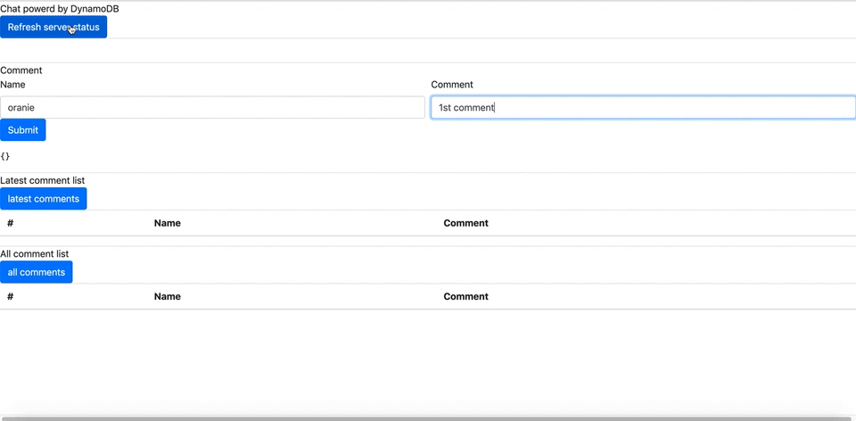
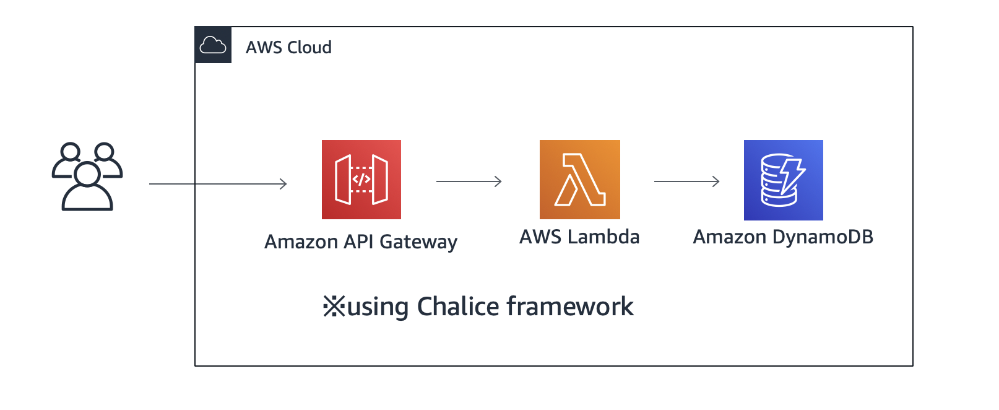
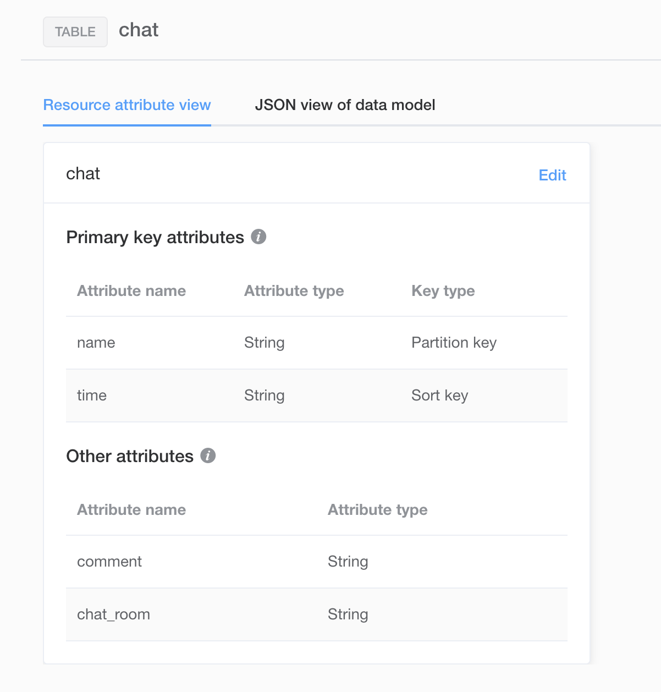
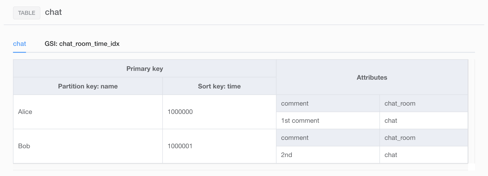
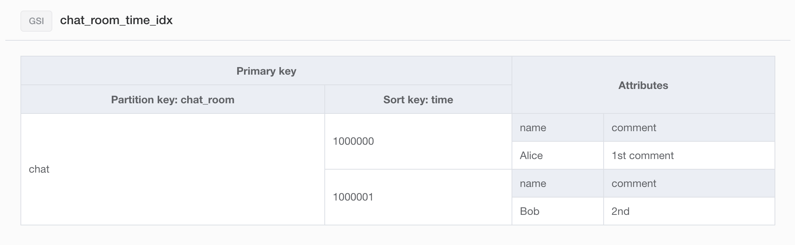

## This project is Amazon DynamoDB training and demo app.


Realtime Comment Demo App




## High level architecture


## Envroiment
DynamoDB (using GSI)

Python 3.7.3+

Please read Chalice project doc.
https://github.com/aws/chalice

local test needs DynamoDB Local.
https://docs.aws.amazon.com/ja_jp/amazondynamodb/latest/developerguide/DynamoDBLocal.html

If you set API_ENDPOINT environment value 'localhost' is using DynamoDB Local 
 (ex: export API_ENDPOINT=localhost)
 
# Amazon DynamoDB setting
DynamoDB Local 
```
 aws dynamodb create-table \
     --endpoint-url http://localhost:8000\
     --table-name chat \
     --attribute-definitions AttributeName=name,AttributeType=S AttributeName=time,AttributeType=S AttributeName=chat_room,AttributeType=S\
     --key-schema KeyType=HASH,AttributeName=name KeyType=RANGE,AttributeName=time\
     --global-secondary-indexes 'IndexName=chat_room_time_idx,KeySchema=[{AttributeName=chat_room,KeyType=HASH},{AttributeName=time,KeyType=RANGE}],ProvisionedThroughput={ReadCapacityUnits=1,WriteCapacityUnits=1},Projection={ProjectionType=ALL}' \
     --provisioned-throughput ReadCapacityUnits=1,WriteCapacityUnits=1
```

DynamoDB
```
 aws dynamodb create-table \
     --table-name chat \
     --attribute-definitions AttributeName=name,AttributeType=S AttributeName=time,AttributeType=S AttributeName=chat_room,AttributeType=S\
     --key-schema KeyType=HASH,AttributeName=name KeyType=RANGE,AttributeName=time\
     --global-secondary-indexes 'IndexName=chat_room_time_idx,KeySchema=[{AttributeName=chat_room,KeyType=HASH},{AttributeName=time,KeyType=RANGE}],ProvisionedThroughput={ReadCapacityUnits=1,WriteCapacityUnits=1},Projection={ProjectionType=ALL}' \
     --provisioned-throughput ReadCapacityUnits=1,WriteCapacityUnits=1
```

## Deploy
This operation needs IAM permission for chalice deploy and using dynamodb.Please check chalice document.

https://github.com/aws/chalice#credentials

### local app start
```$xslt
If you set API_ENDPOINT environment value 'localhost' is using DynamoDB Local 
 (ex: export API_ENDPOINT=localhost)

 # example : DynamoDB local setup command
 java -Djava.library.path=./DynamoDBLocal_lib -jar DynamoDBLocal.jar -port 8000 -inMemory

 # chalice local start up
 chalice local --stage local --port 8080
```

Please create DDB local or local DDB test envroiment.

# Production Deploy
## 1st step : 1st chalice deploy

```$xslt
chalice deploy
```

## 2nd step : Check your generate APIGateway URL
If your 1st chalice deploy done, cli console log is like here.
```
INFO:Found credentials in shared credentials file: ~/.aws/credentials
Updating policy for IAM role: dynamodb-python-chat-sample-dev-api_handler
Updating lambda function: dynamodb-python-chat-sample-dev
Updating rest API
Resources deployed:
  - Lambda ARN: arn:aws:lambda:ap-northeast-1:YOUR_AWS_ACCOUNT_ID:function:dynamodb-python-chat-sample-dev
  - Rest API URL: https://your_APIGW_ENDPONT.execute-api.ap-northeast-1.amazonaws.com/api/ 
```

## 3rd step : set to your api endpoint URL
```
.chalice/config.json 
----------

      "dev": {
        "environment_variables": {
                "API_ENDPOINT": "https://your_API_ENDPOINT"
            }
        }

```
->
```
      "dev": {
        "environment_variables": {
                "API_ENDPOINT": "https://your_APIGW_ENDPONT.execute-api.ap-northeast-1.amazonaws.com/api/"
            }
        }

```
## 4th step : 2nd chalice deploy
```$xslt
chalice deploy
```

## Python Test

pytest should be run without a chat table. If there is an existing table, the test will fail. 

Project root dir "pytest -vv" 


## Amazon DynamoDB Data Modeling
Amazon DynamoDB Data Modeling:

|name(PK)  |time(SK)  |comment  |chat_room |
|---|---|---|---|
|string  |string(micro sec unixtime)  |string  |string |string|

GSI

|chat_room(PK)  |time(SK)  |comment  |name |
|---|---|---|---|
|string  |string(micro sec unixtime)  |string  |string |


## NoSQL  Workbench for DynamoDB capture







this test data json is amazon_dynamodb_chat_sample.json

## API

* /chat

return chat client HTML and js.
    
* /chat/comments/add

client sent post request with name,comment txt, get response add comment status

POST value {"name": "oranie", "comment":"hello world"}


* /chat/comments/all

client sent get request, get all comment.
    
* /chat/comments/latest

client sent get request latest 20 comments.

* /chat/comments/latest/{latest_seq_id}

client sent get request with latest chat id, get the difference comments.
    

# License
This library is licensed under the MIT-0 License. See the LICENSE file.
